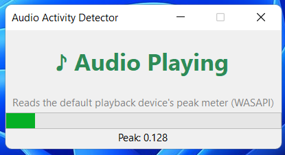

# Audio Activity Detector

A small Windows desktop app that tells you, in real time, whether the system
is currently outputting any audio (any app playing sound through the
default speaker/headphones).



## How it works

Windows exposes a **peak meter** for every audio endpoint through the
**Core Audio API** (WASAPI) — the same data that drives the little bars you
see in the volume mixer. This app talks to that API directly via COM
interop (`CoreAudio.cs`), so it needs **no NuGet packages** (no NAudio,
nothing to restore) — just the .NET SDK.

Every 100 ms it reads `IAudioMeterInformation.GetPeakValue()` for the
default playback device. If the peak is above a small threshold, it's
"Playing"; a short 400 ms hold-time keeps the status from flickering
between audio chunks.

## Requirements

- Windows 10/11
- [.NET 6 SDK](https://dotnet.microsoft.com/download) or later

## Build & run

```powershell
cd AudioActivityDetector
dotnet run
```

Or build a standalone EXE:

```powershell
dotnet publish -c Release -r win-x64 --self-contained true -p:PublishSingleFile=true
```

The published EXE will be under
`bin\Release\net6.0-windows\win-x64\publish\`.

## Files

- `Program.cs` — app entry point
- `MainForm.cs` — the UI (status label, peak meter bar, polling timer)
- `CoreAudio.cs` — minimal WASAPI COM interop (`IMMDeviceEnumerator`,
  `IMMDevice`, `IAudioMeterInformation`)
- `AudioActivityDetector.csproj` — project file (`net6.0-windows`, WinForms)

## Customizing

In `MainForm.cs`:

- `PeakThreshold` — how loud (0.0–1.0) counts as "playing". Raise it if
  background hiss/noise ever triggers a false positive.
- `HoldTime` — how long "Playing" stays shown after the last loud sample,
  to smooth over brief silent gaps between audio chunks.

## Reusing the detector without the UI

`DefaultOutputMeter` in `CoreAudio.cs` is a standalone class — you can drop
it into a console app or a background service:

```csharp
using var meter = new AudioActivityDetector.CoreAudio.DefaultOutputMeter();
float peak = meter.GetPeakValue(); // 0.0 (silence) .. 1.0 (full scale)
bool isPlaying = peak > 0.005f;
```

## Notes

- This detects **system-wide** output (any app), not a specific
  application's audio and not the microphone.
- If the user switches the default playback device while the app is
  running, `DefaultOutputMeter` reconnects automatically on the next read.
